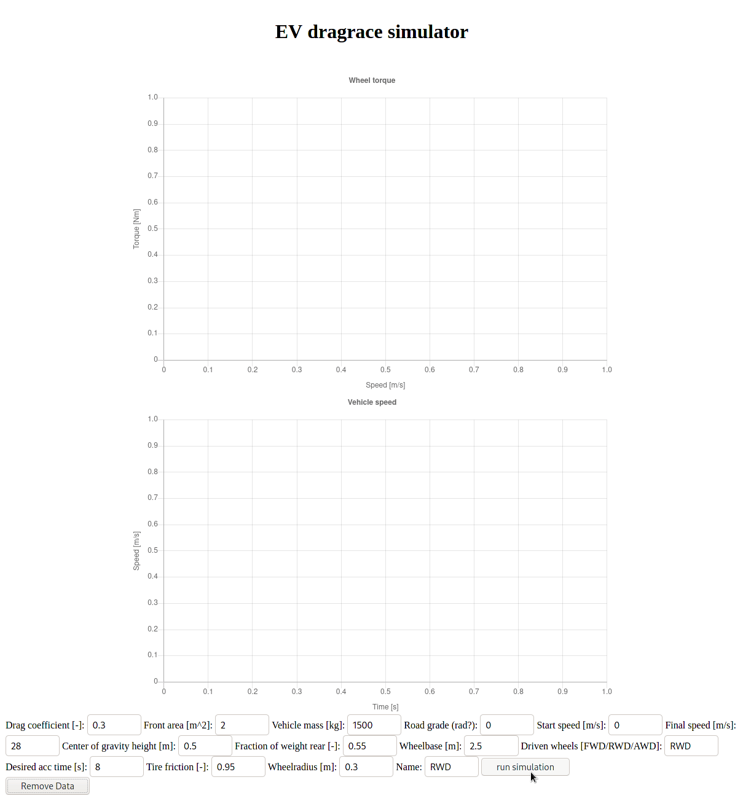

# dragraceSim



A simulator to find desired wheeltorque curves for vehicles

## Running GUI
The GUI is now ready-ish for testing!
run it by invoking
```
$ python flaskpage.py
```
Then point your browser to 127.0.0.1:5000, fill in the boxes and click run to see your result.
It requires many libraries, mainly on the Python side, if you get some errors try:
```
pip install numpy scipy flask matplotlib
```
Replace pip with conda if you are of that persuasion.
Might require new-ish Python version also, 3.8 or newer.
Please post any bugs/issues you find as comments to this repo :)


## Performance
The Python code is now quite fast thanks to @vakuj and some assistance from @najmehabiri, resulting in:
```
NP:       0.1813 s
Vanilla:  0.1791 s
MATLAB:   0.3651 s
Gradient: 0.0175 s
```
See if you can beat that on an average of 10 runs Simon.

## Known issues
JSON reference files are now slightly ill formatted and need to be regenerated. Would be happy to get my hands on some more torque curves for EVs!
